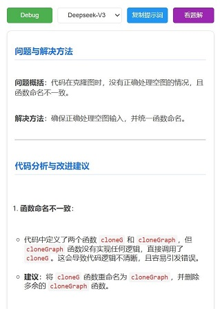

# 🚀 LeetCode AI Debug Assistant

A Chrome extension that helps you debug LeetCode problems using AI assistance.

一个使用AI辅助调试LeetCode问题的Chrome扩展程序。

## 🎯 Usage 使用方法

1. Navigate to a LeetCode problem page
2. Write your code and run the test cases
3. Click the extension icon in Chrome toolbar
4. Select AI model and click "Debug当前代码"
5. View the analysis results and suggestions

<!-- 分隔两个列表 -->

1. 打开LeetCode题目页面
2. 编写代码并运行测试用例
3. 点击Chrome工具栏中的扩展图标
4. 选择AI模型并点击"Debug当前代码"
5. 查看分析结果和建议

## 📥 Installation 安装方法

1. Download the extension files
2. Open Chrome and go to `chrome://extensions/`
3. Enable "Developer mode"
4. Click "Load unpacked" and select the extension folder

<!-- 分隔两个列表 -->

1. 下载扩展程序文件
2. 打开Chrome浏览器，访问 `chrome://extensions/`
3. 启用"开发者模式"
4. 点击"加载已解压的扩展程序"并选择扩展程序文件夹

## 📁 File Structure 文件结构

- `content.js`: Page content extraction / 页面内容抓取
- `background.js`: AI service communication / AI服务通信 
- `popup.html`: UI interface / 界面展示
- `popup.js`: Interaction logic / 交互逻辑

## ✨ Features 功能特点

🔍 **Real-time Code Analysis** 
- Analyzes your LeetCode code and test cases in real-time
- Identifies potential bugs and suggests improvements
  
**实时代码分析**
- 实时分析您的LeetCode代码和测试用例
- 识别潜在的bug并提供改进建议

🤖 **Dual AI Model Support**
- Deepseek-V3: General code analysis
- Deepseek-R1: Advanced reasoning capabilities
  
**双AI模型支持**
- Deepseek-V3：通用代码分析
- Deepseek-R1：高级推理能力

💾 **Smart Caching**
- Caches analysis results for each problem
- Saves time on repeated queries
  
**智能缓存**
- 缓存每个问题的分析结果
- 节省重复查询时间

📝 **Markdown Formatting**
- Typewriter-style like formatted output
- Syntax highlighting for code blocks
  
**Markdown格式化**
- 打字机式格式化输出
- 代码块语法高亮

## 🎨 Additional Features 附加功能

📋 **Copy Prompt**: Copy the current problem context for use in DeepSeek Chat
🧠 **Reasoning Display**: View the AI's reasoning process (when using Deepseek-R1)

📋 **复制Prompt**：复制当前问题上下文以在DeepSeek Chat中使用
🧠 **推理展示**：查看AI的推理过程（使用Deepseek-R1时）

## ⚠️ Note 注意事项

This extension requires a valid DeepSeek API key to function properly.

此扩展程序需要有效的DeepSeek API密钥才能正常运行。

---

Made with ❤️ for LeetCoders

为 LeetCoders 用❤️制作
 